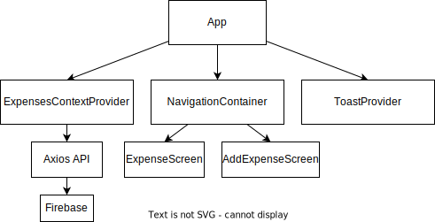

# Assignment 1 - ExpenseTracker

## Project Structure

The project employs **React Navigation** for navigation between different screens.

### Screens

- **AddExpenseScreen**: Here, users can add expenses.
- **ExpenseScreen**: This serves as the application's landing page where users can view the `ExpensesList` and `ExpensesChart`.

### Components

- **ExpensesOutput**: Responsible for displaying the data through the `ExpensesList` and `ExpensesChart`. It also manages the processes of deletion and undoing the deletion.
  
- **ExpenseForm**: Provides a form for users to add expenses.

### Context & Backend

**expenses-context** is the core mechanism that manages the state locally. Interactions with the backend is through HTTP requests with **axios**, the backend is a dummy **Firebase**.


## Specifications

**Adding an Expense:**

- Navigate to `AddExpenseScreen`.
- Fill in details for the expense.
- Submit the expense and return back to `ExpenseScreen`.

**Viewing Expense:**

- Home screen of the application shows a list of expenses.
- Bar graph to display the total amount for each tag.
- Press on a specific bar tag to show the total $ for that tag.

**Deleting Expense:**

- Drag an expense item to the left to delete.

**Undo Deletion:**

- Press the undo button that pops up immediately after deletion.
- The undo button lasts for 5 seconds.

## File & Folder structure

```
📦ExpenseTrackerApp
│
├── 📂components
│   ├── 📂AddExpense
│   │   ├── 📜CustomTextInput.js
│   │   ├── 📜ExpenseForm.js
│   │   └── 📜PickerComponent.js
│   │
│   ├── 📂HandleExpense
│   │   ├── 📜ExpenseItem.js
│   │   ├── 📜ExpensesChart.js
│   │   ├── 📜ExpensesList.js
│   │   └── 📜ExpensesOutput.js
│   │
│   └── 📂Toast
│       └── 📜CustomToast.js
│
└── 📂constants
|   └── 📜styles.js
|    
└── 📂store
|   └── 📜expenses-context.js
|    
└── 📂util
    └── 📜http.js
```

## Use Cases


## App Architecture



## Additional features

Dummy backend with firebase.
