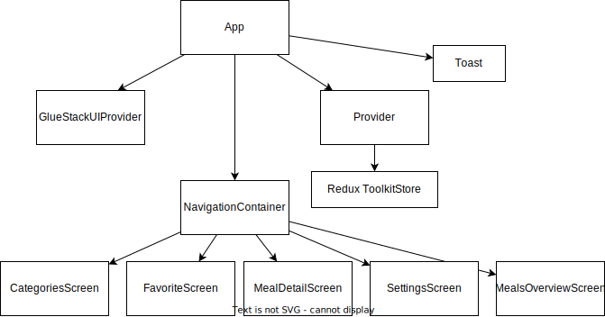
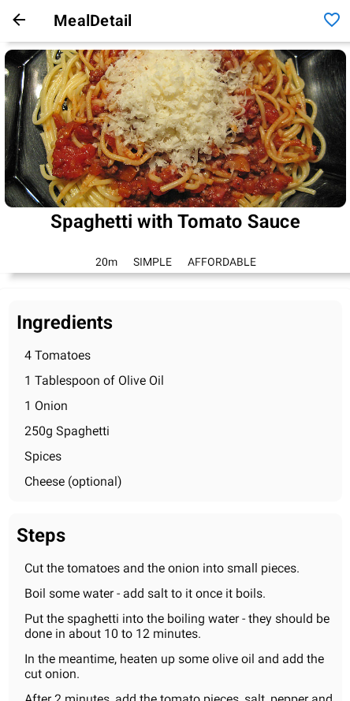

# Assignment 1 - ExpenseTracker

## Project Structure

The project employs **React Navigation** for navigation between different screens.

### Screens

- **CategoriesScreen**: The screen where the categories is shown. This screen uses `CategoryGridTile` to render each grid.
- **FavoriteScreen**: The screen where the users favorite recepies are shown. `MealsList` is used to list the favorite meals
- **MealsOverviewScreen**: The screen where the user can view the meals that is respect with the grid and filter settings. `MealsList` is used to list the meals.
- **MealDetailScreen**: The screen where the user can view the specific meal. Uses the `MealDetails` component to show duration, complexitiy and affordability.
- **SettingsScreen**: The screen where the user can toggle filters and toggle between darkmode and lightmode for the application. This screen uses `GlueStackUI` for components.

### Components

- **MealDetails**: Component for showing duration, complexity and affordability.
- **MealItem**: Represents a single meal. This is a card that shows one meal.
- **MealList**: Component for listing out meals in as a `FlatList`.
- **IconButton**: Component for a pressable icon.
- **CategoryGridTile**: Represents a single category.

### Redux

- Store for handling state through the application.

## Specifications

**View a recipes ingredients & steps**

- Select category
- Select the desired meal/recipe

**Favorite a recipe & view**

- Find a recipe
- Press top right heart icon
- Go back to Home
- Press Favorites in the navbar

**Select a filter**

- Navigate to Home
- Slide from left to right to open the drawer or press top left hamburger menu
- Press Settings
- Toggle the requested filter

**Toggle darkmode**

- Navigate to Settings
- Toggle darkmode

## File & Folder structure

- 📦src
  - 📂components
    - 📂Category
      - 📜CategoryGridTile.js
    - 📂MealComponents
      - 📜MealDetails.js
      - 📜MealItem.js
      - 📜MealsList.js
    - 📜IconButton.js
  - 📂data
    - 📜dummy-data.js
  - 📂models
    - 📜category.js
    - 📜meal.js
  - 📂screens
    - 📜CategoriesScreen.js
    - 📜FavoriteScreen.js
    - 📜MealDetailScreen.js
    - 📜MealsOverviewScreen.js
    - 📜SettingsScreen.js
  - 📂store
    - 📂redux
      - 📜favorites.js
      - 📜filter.js
      - 📜store.js
      - 📜themeSlice.js
  - 📜App.js

## Use Cases

## App Architecture

## Additional features

Dark mode

Filters shown in `MealItem` image.

## Screenshots

   

  

